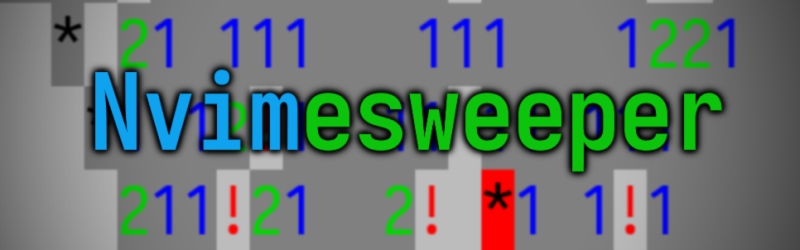

# Nvimesweeper

Play Minesweeper in Neovim: because if Emacs has taught us one thing, it's that
text editors are for gaming!

_This plugin is probably a work-in-progress until I decide I want to be
productive again._

## How to use

Install it using your favourite package manager like any other plugin, then run
`:Nvimesweeper` and pray that it works properly, I guess.

Press `<Space>` to cycle between marking a square as flagged (`!`) or as TODO
(`?`).

Press `<CR>` (Enter/Return) to reveal a square; just try not to step on a mine!

## Why did you make this?

I don't know...
