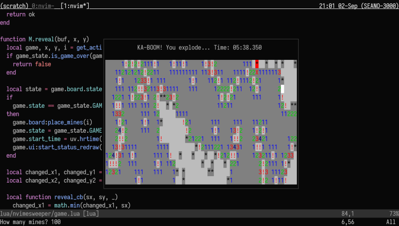

Play Minesweeper in Neovim: because if Emacs has taught us anything, it's that
text editors are for gaming!

_Probably a work-in-progress until I decide I want to be productive again._

## How to play

Install it using your favourite package manager like any other plugin, then run
`:Nvimesweeper` and pray that it works properly, I guess.

- Press `!` to flag a square.
- Press `?` to mark a square for later.
- Press `<Space>` to cycle between `!`, `?` and unmarking a square.
- Press `<CR>` or `x` to reveal a square; just try not to step on a mine!

Run `:help nvimesweeper` for more details.

### Seeding the random number generator

Nvimesweeper does not yet take responsibility for seeding the random number
generator used to place the mines, meaning you may see the same mine layout
after restarting Nvim.

To solve this, you may want to seed the RNG before running `:Nvimesweeper`,
like:

```vim
:lua math.randomseed(os.time())
```

## Why did you make this?

I don't know...
